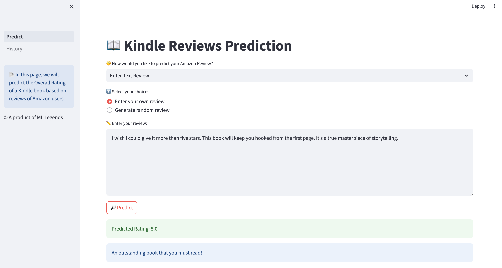
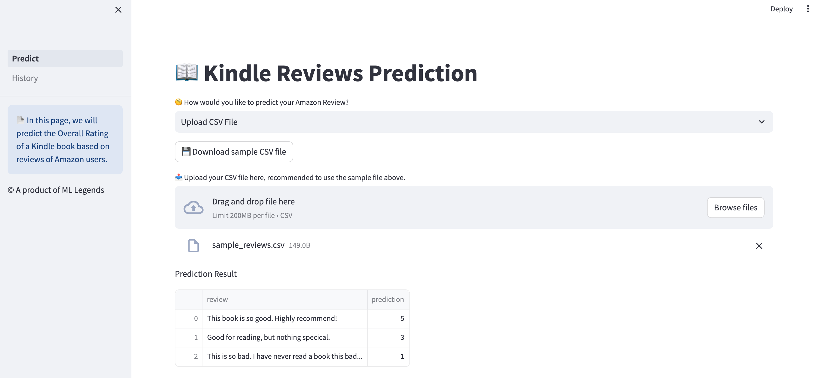
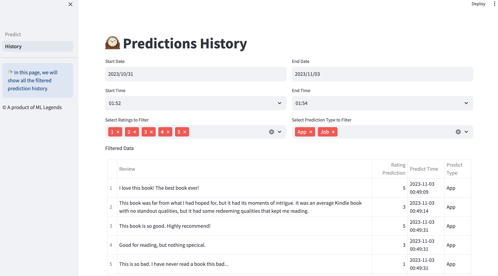
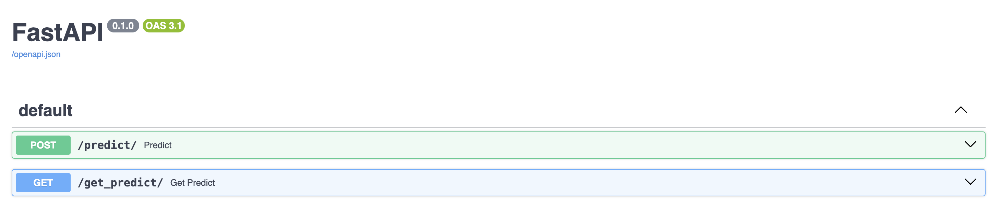
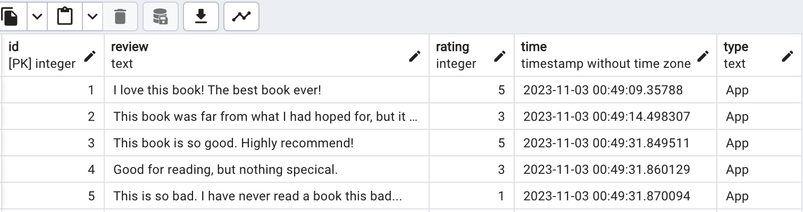
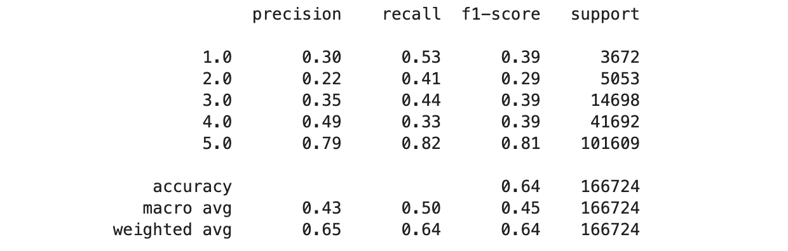
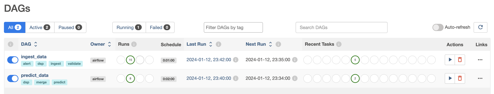
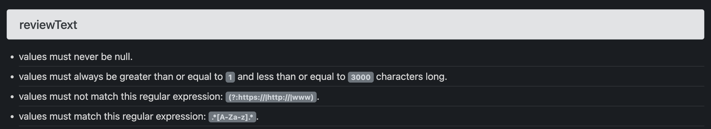
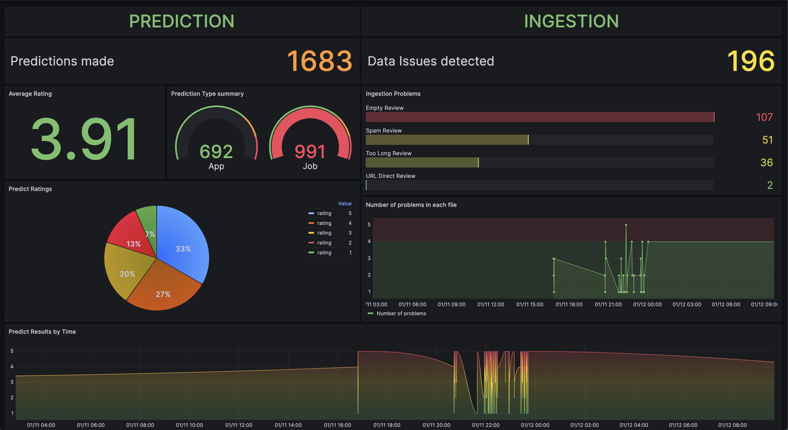

# Data Science in Production: Final Project - Kindle Book Reviews Application

[](http://10.41.173.71:8501)

Welcome to the "Data Science in Production" project by Team “ML Legends” - EPITA Master in Data Science:

- Stephanie Arthaud
- Abubakar Bashir Kankia
- Olanrewaju Adegoke
- Christian Davison Dirisu
- Viet Thai Nguyen

## Introduction

Our project focuses on the Sentiment Analysis of Kindle Book Reviews, aiming to classify them as Positive or Negative by predicting Rating Score. We are utilizing the [Kindle Book Review Dataset](https://nijianmo.github.io/amazon/index.html#complete-data), a rich collection of over 2 million reviews and associated metadata for a diverse range of Kindle books.

We have built a `Streamlit` web app for users to interact with the Machine Learning model through `FastAPI` and `PostgreSQL`. Raw data is ingested and predicted by `Airflow` jobs, after being validated by `Great Expectations`. The pipeline is then monitored by a `Grafana` dashboard.



## File Descriptions

```
├── airflow            # Airflow DAGs validated by Great Expectations
│   ├── dags
│   ├── logs
│   └── gx
├── api-db             # Connect to PostgreSQL by FastAPI
│   ├── main.py
│   └── functions.py
├── app                # 2 pages of Streamlit app
│   ├── Predict.py
│   ├── History.py
│   └── utils.py
├── model              # Store training model
│   ├── DSP_NLP_Review.ipynb
│   ├── dsp_project_model.pkl
│   └── dsp_project_tfidf_model.pkl
├── images             # Store images for README
├── README.md
├── requirements.txt   # Modules version
├── .gitignore
```

## Main components

### Web app

There are 2 pages of the app:

- `Predict`: predicting the Rating by the Review by 3 ways
  - Enter your own review
  - Generate random review
  - Upload a CSV
- `History`: showing all rows in database that can be filtered by time and other types.




### API

We implemented 2 endpoints by FastAPI:

- `predict`: POST request - inference prediction & save data to database
- `get-predict`: GET request - retrieve data from database



### Database

We used PostgreSQL with table including 4 columns:

- `id`: number of predictions
- `review`: review text of users
- `rating`: the score given by prediction
- `time`: time that user makes the prediction
- `type`: the prediction is made by the App or Prediction Job



### Modelling

To train the model, we used:

- Term Frequency - Inverse Document Frequency (TFIDF)
- Linear Support Vector Machine (SVM)



### Jobs scheduling

We created 2 DAGs in Airflow for 2 jobs:

- `ingest_data`: Ingest new data, validate the data by using Great Expectations module, running each 1 min.
- `predict_data`: Predict a batch of new coming data, running each 2 min.



### Data Validation

We used Great Expectations to validate raw data by 4 requirements:

- The review cannot be null.
- The review cannot be too long.
- Spam review will not be accepted.
- Do not allow the review having the direct URL.



### Data Monitoring

By a Grafana dashboard, we can monitor all the data from Prediction and Ingestion jobs which is stored in PostgreSQL tables.



## Contributing

We welcome contributions to this project! Here's how you can contribute:

1. Fork the Repository
2. Clone the Repository
3. Create a New Branch
4. Make Your Changes
5. Commit Your Changes
6. Push Your Changes
7. Submit a Pull Request

Remember, contributing to open source projects is about more than just code. You can also contribute by reporting bugs, suggesting new features, improving documentation, and more.

Thank you for considering contributing to this project! 😊
